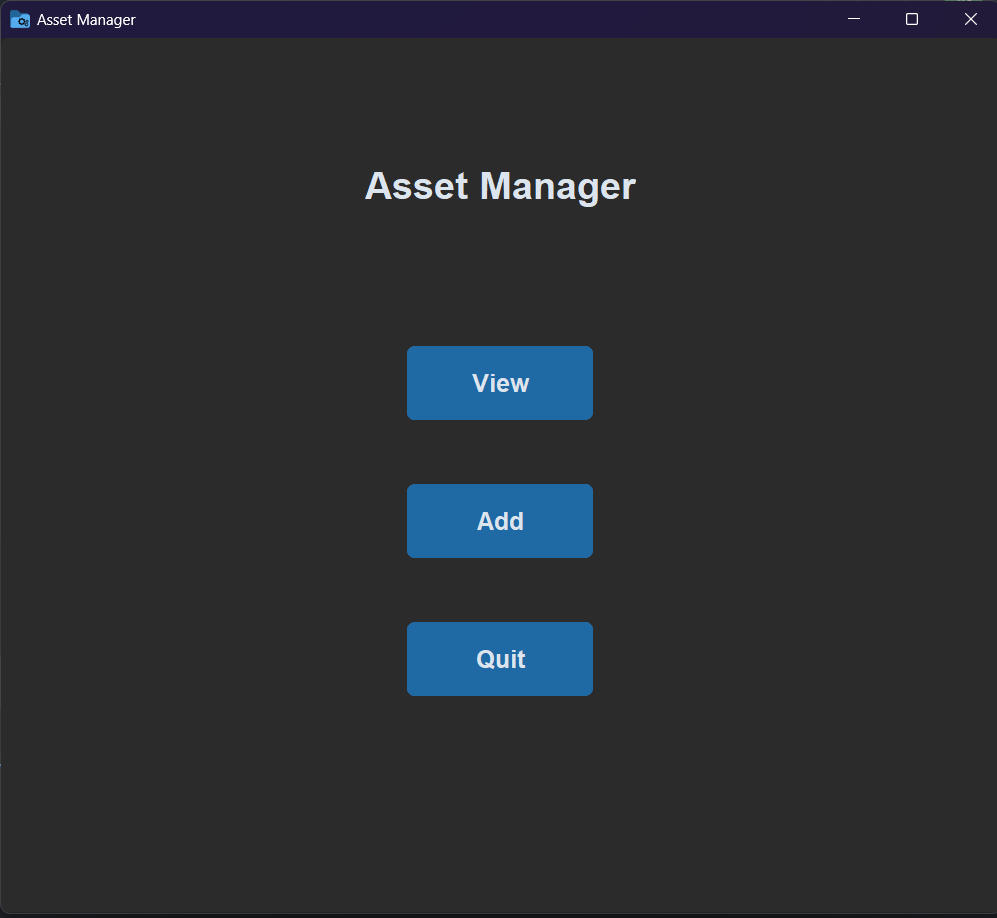

# 💼 Asset Manager App

A modern desktop GUI application built with `CustomTkinter` to manage, view, add, search, and edit assets — complete with QR code generation and CSV-based storage.

---

## 📁 Files Included

- `app.py` → Main application file  
- `requirements.txt` → Python dependencies  
- `assets.csv` → The CSV database for storing asset records   
- `icon.ico` → Custom icon for the app and EXE

---

## 🖥️ Features
📂 View and search assets
➕ Add new rows and columns
✏️ Edit asset entries directly in a popup window
🔍 Search across all fields
🔐 CSV-based storage (easily portable)
🔄 QR Code generated for each asset (click to save!)
🌙 Clean dark-mode UI using `CustomTkinter`

---
## 🧠 How It Works

The app reads from `assets.csv` and allows you to:

* Add/edit/delete rows and columns
* Search for keywords across the whole sheet
* Display assets in a stylized table
* Click on any row to edit the asset and generate a downloadable QR code

Changes made in the app are **immediately saved to the CSV file**.

---

## UI Screenshots

# Home Page


---
## 📦 Requirements

Install the dependencies using:

```bash
pip install -r requirements.txt
````

### `requirements.txt`

```text
customtkinter
pandas
qrcode
Pillow
```

---

## ▶️ How to Run the App

```bash
python app.py
```

---

## 🛠️ How to Build the .exe File (Windows)

### 1. 🔄 Activate Your Virtual Environment

```powershell
& "C:\Users\ASUS\PycharmProjects\RAG\.venv\Scripts\Activate.ps1"
```

### 2. ⬇️ Install PyInstaller

```powershell
pip install pyinstaller
```

### 3. 🛠️ Build the Executable

Make sure you're in the same folder as `app.py` and `icon.ico`, then run:

```powershell
python -m PyInstaller --noconsole --onefile --icon=icon.ico app.py
```

### 4. ✅ Locate Your EXE

Your `.exe` will be inside the `dist/` folder:

```
dist/app.exe
```

Double-click it to launch the Asset Manager as a standalone app 🎉

---

## 🙌 Credits

Made with ❤️ by Akarsh

---

## 📜 License

This project is open-source under the [MIT License](LICENSE).

```
